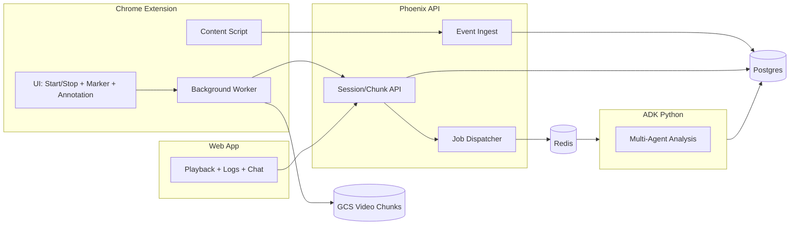

# Architecture and Data Flow

## System boundaries
- **Client**: Chrome extension (MV3) + Web app.
- **API**: Phoenix backend.
- **Storage**: GCS (video chunks), Postgres (metadata), Redis (queues).
- **AI**: Python ADK service using Gemini models.

## Core components
- Extension UI (start/stop, markers, annotations, idle prompt).
- Background worker (capture control, upload orchestration).
- Content script (interaction capture + DOM context).
- Web app playback + analysis viewer + chat UI.
- API server (session/chunk management, event ingest, signed URLs).
- ADK multi-agent analysis pipeline (per chunk + aggregation).

## Data flow (high level)
1. Extension creates a session and receives signed upload URLs.
2. Active-tab capture streams into 10-min chunks and uploads to GCS.
3. Events (interactions, logs, markers, annotations, env) batch to API.
4. API stores metadata in Postgres and enqueues analysis per chunk.
5. ADK analyzes chunk and writes findings to Postgres.
6. Web app shows chunk analysis badge; final report after session ends.

## Mermaid diagram

